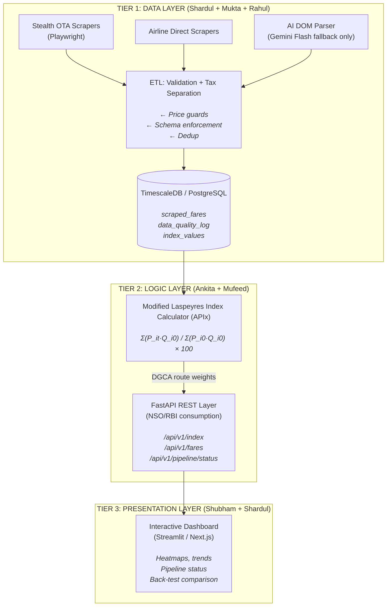

<div align="center">

# 🛫 VegaBytes — Airfare Price Index (APIx)
### SIH Problem Statement 26056 | Real-time Airfare Price Index for India

[](https://github.com/shard-c6/VegaBytes_25056/actions/workflows/ci.yml)
[](https://github.com/shard-c6/VegaBytes_25056/actions/workflows/scraper_cron.yml)
[](https://python.org)
[](LICENSE)
[](https://github.com/shard-c6/VegaBytes_25056/issues)

**A high-frequency economic data pipeline for the NSO/RBI — not a flight comparison app.**

[Architecture](#architecture) · [Setup](#quick-start) · [API Docs](#api) · [Team](#team) · [Contributing](CONTRIBUTING.md)

</div>

---

## Problem Statement

The National Statistical Office (NSO) measures airfare inflation using **manual, periodic data collection** — a method blind to real-time algorithmic pricing where a single ticket can fluctuate 200–400% in a day. This distorts the CPI Transport sub-group, leading the RBI to set monetary policy on lagged, inaccurate data.

**VegaBytes** solves this with an automated, statistically rigorous pipeline that scrapes, validates, and indexes Indian domestic airfares in near real-time — producing the **Airfare Price Index (APIx)**.

> Inspired by the **MIT Billion Prices Project (Cavallo & Rigobon)**, which proved online scraped data can track inflation faster and more accurately than traditional government methods.

---

## Architecture



---

## Quick Start

### Prerequisites
- Python 3.11+
- PostgreSQL 14+ (or Supabase/Neon free tier)
- A Gemini API key (free — for AI DOM parser fallback)

### Installation

```bash
# 1. Clone and enter repo
git clone https://github.com/shard-c6/VegaBytes_25056.git
cd VegaBytes_25056

# 2. Create virtual environment
python -m venv .venv && source .venv/bin/activate

# 3. Install all dependencies
pip install -e ".[dev]"

# 4. Install Playwright browsers
playwright install chromium

# 5. Configure environment
cp .env.example .env
# Edit .env with your DATABASE_URL, GEMINI_API_KEY, TELEGRAM_BOT_TOKEN

# 6. Apply database schema
psql $DATABASE_URL -f db/schema.sql
```

### Run Tests

```bash
pytest tests/ -v --cov=src
```

### Run Scraper (single pass)

```bash
python -m src.scrapers.run_pipeline
```

### Start API Server

```bash
uvicorn src.api.main:app --reload --port 8000
# Docs: http://localhost:8000/api/docs
```

---

## API

| Endpoint | Description |
|----------|-------------|
| `GET /health` | Liveness probe |
| `GET /api/v1/index` | Latest APIx value |
| `GET /api/v1/index/history?from_date=&to_date=` | Historical index series |
| `GET /api/v1/fares?route=DEL-BOM&page=1` | Raw fare records (paginated) |
| `GET /api/v1/pipeline/status` | Pipeline health |

Interactive docs: `/api/docs` (Swagger) · `/api/redoc` (ReDoc)

---

## Index Methodology

The **APIx** uses a **Modified Laspeyres Formula**:

```
APIx_t = Σ(P_it × Q_i0) / Σ(P_i0 × Q_i0) × 100
```

| Variable | Meaning |
|----------|---------|
| `P_it` | Current period **base fare** for route `i` |
| `P_i0` | Base period base fare for route `i` |
| `Q_i0` | DGCA passenger traffic weight for route `i` |

- **Base fares only** (taxes excluded) — isolates pure price signal
- **Weights** from DGCA quarterly traffic data (top 5 domestic routes)
- **Missing data** handled via Carry-Forward Imputation
- **Outliers** (Diwali surges) dampened with 3σ clipping

This formula directly mirrors MoSPI's official CPI methodology, enabling apples-to-apples back-testing against the eSankhyiki dataset.

---

## Compliance & Legal

This pipeline is designed for **statistical research under MoSPI's mandate** (Collection of Statistics Act, 2008):

- ✅ Respects `robots.txt` crawl delays on all sources
- ✅ Request rate capped at **< 2 req/min per IP**
- ✅ No PII is intentionally collected or stored — only public price, route, and timestamp data
- ✅ Data used solely for CPI augmentation research
- ✅ Aligns with *hiQ Labs v. LinkedIn* precedent (scraping public data for research)

---

## Project Structure

```
VegaBytes_25056/
├── src/
│   ├── scrapers/
│   │   ├── base.py              # Factory pattern base class
│   │   ├── indigo_direct.py     # IndiGo scraper (Shardul)
│   │   └── ai_dom_parser.py     # Gemini Flash fallback (Shardul)
│   ├── etl/
│   │   └── validator.py         # Price validation & quality (Mufeed)
│   ├── index/
│   │   └── laspeyres.py         # Modified Laspeyres calculator (Ankita)
│   ├── api/
│   │   └── main.py              # FastAPI REST layer (Mufeed)
│   └── monitoring/
│       └── alerter.py           # Telegram alerts (Mukta)
├── db/
│   └── schema.sql               # Full PostgreSQL schema
├── tests/
│   ├── test_validator.py
│   └── test_laspeyres.py
├── docs/
│   ├── project_idea_elaboration.md
│   └── loopholes_260826.md
├── .github/
│   ├── workflows/
│   │   ├── ci.yml               # Lint + test on every PR
│   │   └── scraper_cron.yml     # Scheduled 4-hourly scraping
│   ├── ISSUE_TEMPLATE/
│   └── pull_request_template.md
├── .env.example
├── pyproject.toml
├── CONTRIBUTING.md
├── SECURITY.md
├── CODE_OF_CONDUCT.md
└── LICENSE
```

---

## Team

| Name | Role | Tier | GitHub |
|------|------|------|--------|
| **Shardul** | Scraping Lead + System Architect | Tier 1 + Tech Q&A | [@shard-c6](https://github.com/shard-c6) |
| **Rahul** | Airline Direct Scrapers | Tier 1 | [@rahulcodes-java](https://github.com/rahulcodes-java) |
| **Mukta** | Cloud Infra + Monitoring | Tier 1 | [@Mukta01](https://github.com/Mukta01) |
| **Ankita** | Index Math + eSankhyiki Analysis | Tier 2 | [@ankita01209](https://github.com/ankita01209) |
| **Mufeed** | Backend Support + Data Validation | Tier 2 | [@mufeedrajapkar](https://github.com/mufeedrajapkar) |
| **Shubham** | Backend Lead + APIs + Dashboard + Pitch Lead | Tier 2 & 3 | [@Shubham-Vaidya](https://github.com/Shubham-Vaidya) |

---

## Deadline

**September 4, 2026** — SIH 2026 Finale

Current Sprint: **Sprint 1** — Cloud infra, first scraper, DGCA weights

---

<div align="center">

Built with 🔥 for Smart India Hackathon 2026

</div>
