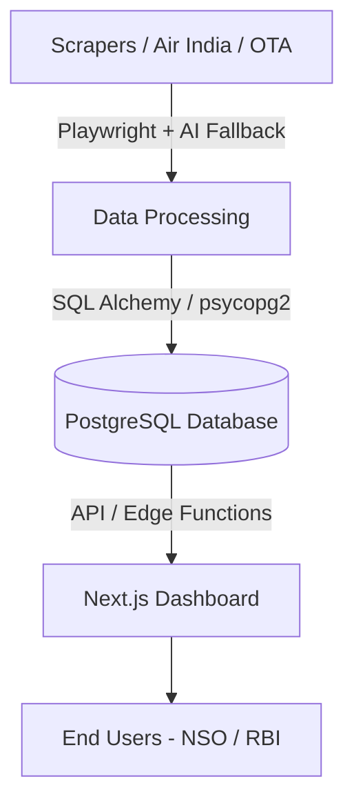

# VegaBytes Architecture Document

This document outlines the high-level architecture of VegaBytes, an open-source real-time Airfare Price Index pipeline tailored for the National Statistical Office (NSO) and the Reserve Bank of India (RBI).

## Overview

The system consists of three main components:
1. **Data Acquisition Pipeline (Scrapers):** Python-based scrapers utilizing Playwright for headless browser automation and a fallback AI DOM Parser utilizing Google Gemini 1.5 Flash to extract fare records resiliently.
2. **Database:** A cloud PostgreSQL database (e.g. Neon or Supabase) to persist scraped flight data securely and allow structured SQL querying.
3. **Dashboard:** A Next.js front-end application to present statistical indices (e.g., Modified Laspeyres Index), time-series analyses, and compliance monitoring data in real time.

## 1. Data Acquisition Pipeline

The scrapers are orchestrated using a robust Factory Pattern (`ScraperFactory`).

- **BaseScraper**: Defines the abstract interface and standardizes `FareRecord` creation, proxy support, and rate-limiting.
- **Primary Extraction**: Scrapes the DOM directly via CSS selectors to extract base fares, taxes, and total fares.
- **AI DOM Parser Fallback**: In case structural changes occur to the airline websites, an `AIdomParser` utilizes Gemini Flash to intelligently parse the HTML fragments for JSON structured data without relying on brittle CSS.

### Compliance
Scraping frequency is strictly managed with `tenacity` retries and exponential backoff to adhere to rate-limiting policies (`robots.txt`), ensuring ethical data acquisition without DoS footprints.

## 2. Storage & Database

The system utilizes PostgreSQL to warehouse data robustly over time.
- **ORM:** SQLAlchemy is used to define the schema mappings.
- **Migrations:** Alembic tracks DB schema migrations seamlessly.
- **Hosting:** Suitable for zero-cost deployment options like Supabase or Neon.

## 3. Visualization Dashboard

A Next.js dashboard visualizes the data and provides actionable insights.
- **Tech Stack:** React, Next.js, and Recharts/Chart.js for graphing.
- **Use Case:** Exposes the calculated Laspeyres Index and provides route-level drill-downs for analysts to monitor airfare inflation.
