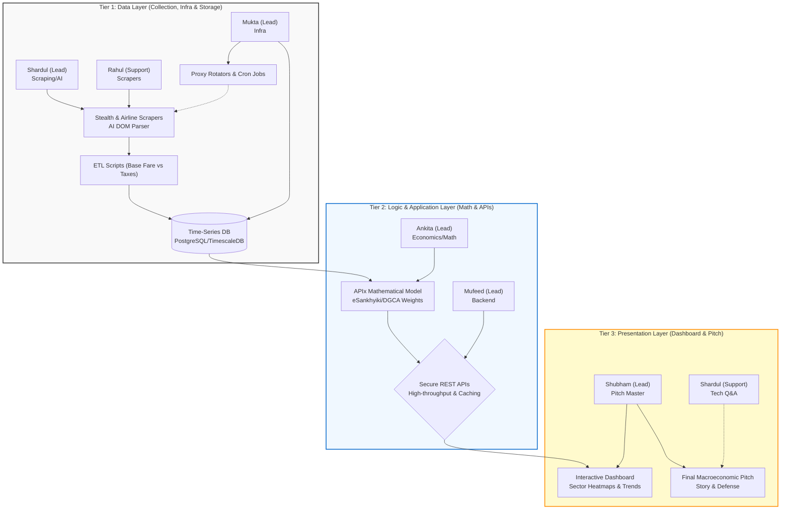

Here is a deep-dive analysis of the SIH Problem Statement **26056: Real-time Airfare Price Index for India**.

---

### 1. Pain Points & Core Understanding 🔎

- **What exact problem is being addressed?**
  The National Statistical Office (NSO) currently calculates the Consumer Price Index (CPI) for airfares using **manual, periodic data collection** from a limited number of sources. This method completely misses the reality of dynamic, algorithm-driven airline pricing, where a ticket can fluctuate by 200–400% in a single day based on demand, booking windows, and cookies.
- **Why does this problem exist (root causes)?**
  Over 90% of tickets are now sold online via OTAs (MakeMyTrip, Ixigo) and airline sites. Airlines use advanced revenue management systems to change prices by the minute. MoSPI’s legacy manual data collection simply cannot keep up with high-frequency internet data.
- **Primary stakeholders:**
- **MoSPI/NSO:** Needs accurate data to measure national inflation.
- **Reserve Bank of India (RBI):** Relies on accurate CPI data to set interest rates and monetary policy.
- **Indian Citizens:** Benefit from sound national economic policies based on reality.

- **Current inefficiencies:**
  Manual sampling leads to lagged, smoothed-out, or flatly incorrect inflation metrics for the Transport sub-group, distorting the CPI.

---

### 2. Feasibility of Execution ⚙️

- **Can a working prototype be built?**
  Yes, but it is heavily dependent on the team's data engineering skills. Building a scraper is easy; building a _resilient_ scraper that survives bot-protection is hard.
- **Technical Requirements:**
- **Scraping:** Python (Playwright or Selenium with Stealth plugins, Scrapy).
- **Infrastructure:** Proxy rotators (Residential IPs to avoid bans), Cloud Scheduler/CRON jobs.
- **Database:** PostgreSQL or TimescaleDB (ideal for time-series data).
- **Frontend:** Streamlit, Dash, or Next.js for the visualization dashboard.

- **Blockers:**
- Dynamic DOM structures (OTAs change their HTML classes frequently).
- Aggressive Web Application Firewalls (WAF) like Cloudflare or Akamai blocking automated scripts.

- **The MVP:**
  A live pipeline that scrapes **3 specific routes** (e.g., DEL-BOM, BLR-DEL) from **2 sources** (e.g., IndiGo direct + MakeMyTrip) across **3 booking windows** (T+1, T+7, T+30), storing the data in a DB, and visualizing the daily index on a dashboard.

---

### 3. Impact & Relevance 🌍

- **Who benefits?**
  The RBI and MoSPI. This is a macro-economic tool, not a B2C consumer app.
- **Real-world impact:**
  Highly accurate inflation targeting. This brings India in line with modern economic statistical methods, mirroring the famous **Billion Prices Project by MIT**, which revolutionized how inflation is tracked using scraped online retail data.
- **Scalability:**
  Massive. If your architecture succeeds for airfares, the exact same pipeline can be sold/scaled to MoSPI to track e-commerce prices (Amazon/Flipkart), ride-hailing (Uber/Ola), and hotel rates for CPI augmentation.
- **Evaluator Importance:**
  It solves a critical, documented gap in national governance using modern data engineering. It is highly prestigious.

---

### 4. Scope of Innovation (Existing Solutions) 💡

- **Existing Solutions:** Google Flights, Skyscanner, Kiwi.
- **Limitations:** These are consumer-facing aggregators designed to sell tickets. They do not calculate national economic indices, nor do they expose the raw base fare vs. tax breakdowns in a format usable by the RBI.
- **Competitor Analysis & Context:**
  Research the **MIT Billion Prices Project (Cavallo & Rigobon)**. They proved that daily online scraped data can track and even anticipate official inflation much faster than traditional government methods.
- **How to Stand Out:**
- **AI-Resilient Scraping:** Instead of hard-coding CSS selectors (which break), use an LLM (like Gemini or GPT-4o-mini) to dynamically parse the raw HTML and extract the prices regardless of structural changes.
- **Mathematical Rigor:** Don't just show an average price. Implement a **Laspeyres** or **Jevons Index** formula, mathematically weighting the routes based on the DGCA's actual passenger traffic data.

---

### 5. Clarity of Problem Statement 🧩

- **Clear Deliverables:**

1. A web-scraping engine.
2. A cleaned database (Base fare vs. Taxes).
3. An Index Construction Module (APIx).
4. A Dashboard + API for the RBI.

- **Where teams misinterpret this:**
  Many amateur teams will build a "flight ticket price comparison app" for users to find cheap flights. **This is an instant disqualification.** Evaluators want an _Economic Statistical Indexing Platform_ designed for economists.
- **Framing:**
  Present the solution strictly as a "High-Frequency Economic Data Pipeline" for government monetary policy.

---

### 6. Evaluator's Perspective 🎯

- **How they will judge:**

1. **Robustness:** Does the scraper crash when Cloudflare pops up?
2. **Data Integrity:** Did you actually separate the Base Fare from the User Development Fee (UDF) and Taxes? (This is a specific requirement).
3. **Compliance:** Are you respecting `robots.txt` and rate limits?

- **Red Flags:**
- Using paid third-party APIs (like Amadeus or SerpApi) instead of building a custom scraping engine (the PS explicitly asks you to build the scraper).
- Hardcoded scripts that only work on one perfect run.

---

### 7. Strategy for Team Fit & Execution 👥

- **Skill Sets Needed:**
- **2 Data Engineers:** Heavy lifting on scraping, proxy rotation, bypassing bot protections, and ETL pipelines.
- **1 Data Scientist / Economist:** To calculate the actual APIx index, handle outlier smoothing (e.g., Diwali surges), and back-test the data.
- **2 Full-Stack/Backend:** To build the database, the API, and the dashboard.
- **1 Presenter:** To explain the macroeconomic value to the judges.

- **Ideal Ratio:** 4 Core Tech : 2 Domain/Data Science.
- **Step-by-Step Approach:**

1. Download DGCA traffic data immediately to identify the top 5 busiest routes (weights).
2. Set up Playwright and residential proxies. Target one easy site (airline direct) and one hard site (OTA).
3. Write the ETL script to isolate base fare from taxes.
4. Build the index formula and hook it to a Streamlit dashboard.

---

### 8. AI-Buildability Split (20/80) 🤖

- **The 20% (AI can build fast):**
  AI can write the boilerplate Playwright scraping scripts, the Regex for data cleaning, the SQL schema, and the Streamlit UI code in minutes.
- **The 80% (Needs humans):**
  Handling IP bans, bypassing dynamic CAPTCHAs, configuring residential proxies, and defining the statistical methodology for the Index. AI cannot bypass a live Cloudflare challenge for you during the hackathon.
- **Risk:** If the team relies on ChatGPT to write the scraper, it will likely use outdated CSS selectors or standard Selenium, which OTAs block instantly.
- **Structural Change Test:**
- _Judge:_ "MakeMyTrip just blocked your IP. Can you swap your source to Yatra live right now?"
- _Need:_ A modular, factory-pattern architecture where adding a new data source is as simple as plugging in a new URL and parser, without rewriting the whole engine.

---

### 9. Data & Resource Availability 📊

- **Real Datasets:**
- DGCA Passenger Traffic Data is public (to determine route weights).
- Historical airline prices (Kaggle has several "Indian Flight Prices" datasets) can be used for the back-testing requirement.

- **Data Strategy:**
  Start running your scrapers **weeks before the hackathon finale**. The PS requires "30 days of back-tested results." You need to start collecting real-time data immediately so you have a rich database to show on demo day.
- **Backup Plan:**
  If the scraper breaks on demo day due to Wi-Fi limits or live bot-protection, use a pre-scraped, synthetically aged Kaggle dataset stored in your DB to prove the Dashboard and Indexing algorithms still work perfectly.

---

### 10. Judge Q&A Stress-Test 🎤

**Q1. "OTAs actively block scrapers. How are you bypassing their protections without violating ethical guidelines?"**

- **Sharp Answer:** "We employ 'polite scraping' architectures. We respect the `robots.txt` crawl delays, use Playwright-stealth to render JavaScript naturally, and rotate residential IPs to distribute our footprint. We keep our request rate strictly below human-throttle limits (e.g., 2 requests/minute per IP) ensuring zero server strain, which aligns with fair-use data collection for statistical research."

**Q2. "How did you separate the Base Fare from Taxes, given that OTAs often bundle them on the frontend?"**

- **Sharp Answer:** "We noticed this limitation on OTAs. To solve it, our pipeline uses a hybrid approach: we scrape the final dynamic price from the OTA, but we scrape the fixed tax structures (UDF, GST) directly from the Airline's tariff pages for that specific route. We then retroactively deduct the known taxes from the OTA's total to isolate the true base fare elasticity."

**Q3. "What happens to your index on T+1 if a flight is completely sold out and returns no price?"**

- **Sharp Answer:** "A naive system would drop the row or record a zero, crashing the index. Our pipeline uses a 'Carry-Forward Imputation' for missing T+1 data based on the T+2 closing price, or flags it as an 'Infinite Demand' outlier, ensuring the APIx remains statistically stable and doesn't trigger false deflation signals to the RBI."
- _Follow-up:_ "How do you ensure outliers like Diwali surges don't skew the monthly average?"

---

### Final Verdict 🏁

**🟢 GREEN LIGHT**

**The Biggest Reason:** This is a hardcore, well-defined engineering problem with a massive real-world economic payoff. It filters out "idea-only" teams. If your team has strong backend and data engineering chops to solve the web-scraping bot-protection puzzle, you will easily stand out from the crowd. Furthermore, it directly tackles a prestigious macroeconomic issue (augmenting the CPI), making it highly attractive to government evaluators.

**Subject: Project Kickoff & Updated Role Assignments: SIH PS 26056 (Real-time Airfare Price Index)**

Team,

We are officially kicking off our execution for SIH Problem Statement 26056. Our objective is to build a highly resilient, automated web-scraping pipeline and index-calculation dashboard for the NSO/RBI.

We are operating on a strict timeline with a final deadline of **September 4**. To ensure we deliver a working, back-tested prototype on time, we will be utilizing an **Agile methodology** working in rapid, focused sprints. We will hold daily stand-ups to unblock each other, and all code, research, and data must be integrated iteratively.

A critical component of this project is the **eSankhyiki / RBI dataset** provided in the problem statement. This is not just reference material—it is our ground truth. We must use it to extract base weights for the CPI and perform a mandatory 30-day back-test to prove our real-time index is mathematically sound compared to official lag data.

To maximize our efficiency and align with industry-standard system design, I have mapped our responsibilities into a **3-Tier Architecture Model (Data, Logic, Presentation)**. This ensures clear boundaries for execution and deployment.

### Tier 1: Data Layer (Collection, Infrastructure & Storage)

**Leads:** Shardul (Scraping/AI) & Mukta (Infra) | **Support:** Rahul

- **Primary Responsibility:** Sourcing, extracting, and securely storing the raw airfare data at scale.
- **Execution Strategy (Shardul & Rahul):** Shardul will architect the stealth web scrapers to bypass bot protections, build the AI-based DOM parser as a fallback for structural website changes, and write the ETL scripts to separate base fares from taxes. Rahul will build dedicated scrapers for direct airline portals (IndiGo, Akasa, etc.) to feed seamlessly into our primary pipeline. Shardul also owns the deep technical architecture for the final evaluation.
- **Execution Strategy (Mukta):** You will configure the residential proxy rotators and deploy our scrapers on cloud compute using automated cron schedules (capturing T+1, T+7, etc.). You will also provision and manage the production database (e.g., PostgreSQL/TimescaleDB) to store our time-series data.

### Tier 2: Logic & Application Layer (Index Math, Processing & APIs)

**Leads:** Ankita (Economics/Math) & Mufeed (Backend Services)

- **Primary Responsibility:** Transforming raw data into the statistically valid Airfare Price Index (APIx) and serving it via APIs.
- **Execution Strategy (Ankita):** You will analyze the eSankhyiki historical CPI series and DGCA passenger traffic data to calculate exact route weights. Your output is the actual mathematical model for the Airfare Price Index (APIx). You will also manage the back-testing reports comparing our live data against the official MoSPI baseline.
- **Execution Strategy (Mufeed):** You will focus heavily on building the secure REST APIs required for NSO/RBI consumption and ensuring the backend architecture can handle high-throughput queries, caching, and serving the processed index data seamlessly.

### Tier 3: Presentation Layer (Dashboard & Pitch Strategy)

**Lead:** Shubham | **Support:** Shardul (Tech Q&A)

- **Primary Responsibility:** Visualizing the index, building the interactive dashboard, and delivering the final macroeconomic pitch.
- **Execution Strategy (Shubham):** You will develop the interactive dashboard to visualize the sector heatmaps, price trends, and index calculations. **Crucially, you are our Pitch Master.** You will own the final presentation and narrative, translating our complex 3-tier pipeline into a compelling macroeconomic story for the judges. (Note: Shardul will step in alongside you during the Q&A to handle deep technical/system architecture questions).

### Project Architecture & Role Distribution Diagram

---

Our first sprint begins immediately. Our goal for Sprint 1 is to establish the initial cloud database, write the first successful scraper for a single route, and map out the exact DGCA/MoSPI weights.

Please review your respective domains and prepare a brief outline of the immediate tools or datasets you need to begin your modules.

Let’s build something exceptional.

Best regards,

Shardul
